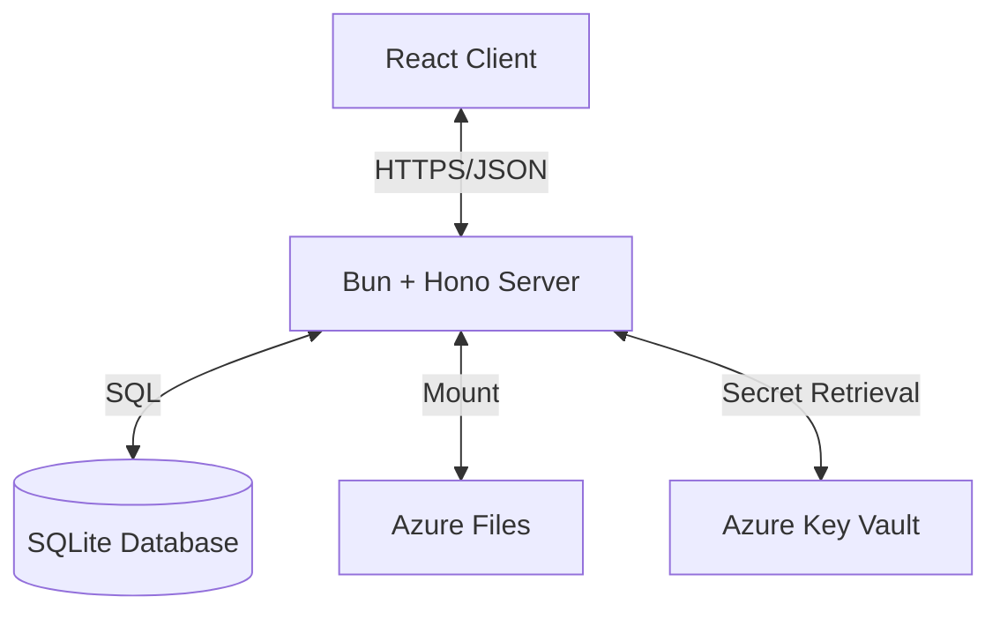

# Architecture Overview

## System Diagram

## Component Breakdown

### Frontend (Client)
- **Framework**: React + Vite
- **State Management**: React Query (Server state), Zustand (Local UI state), Context API (Auth)
- **Routing**: React Router v6
- **Styling**: Tailwind CSS
- **Visualization**: React Flow for the interactive node graph

### Backend (Server)
- **Runtime**: Bun
- **Framework**: Hono (lightweight, fast web standard based)
- **ORM**: Drizzle ORM (Type-safe SQL)
- **Database**: SQLite (Simple, portable, sufficient for current scale)
- **Authentication**: JWT based (Access + Refresh tokens)

### Data Model

**Users**
- Central identity.
- Stores `encryptedUserKey` (KEY_U encrypted with KEY_MASTER).

**Family Trees**
- Container for people and relationships.
- Owned by a User.

**Encrypted Data**
- `People` and `Events` tables contain encrypted fields (`encryptedFirstName`, etc.).
- Decryption happens on the server ONLY after authenticating the user and retrieving their specific key.

## Data Flow

1. **Login**:
   - User sends Email + Password.
   - Server verifies hash.
   - Server decrypts `encryptedUserKey` using Master Key (from Key Vault).
   - Server derives `User Key` (KEY_U).
   - Server returns JWT. (In a more advanced setup, KEY_U might be sent to client or kept in session memory, currently assumes server-side decryption per request or session).
   *Current Implementation*: Key is derived on login, used for session? 
   *Correction*: In stateless JWT, we need the key for every request. 
   *Security Note*: We send the derived `User Key` to the client (over HTTPS) and the client sends it back in a header `X-User-Key`. This keeps the server stateless.

2. **Fetching Data**:
   - Client sends Request + JWT + `X-User-Key`.
   - Server verifies JWT.
   - Server queries Encrypted Data.
   - Server uses `X-User-Key` (from header) to decrypt data.
   - Server sends Plaintext Data to client.

## Deployment Architecture

- **Platform**: Azure App Service (Linux Container)
- **Container**: Single Docker image serving both API and Static Assets.
- **Storage**: Azure Files mounted to container for SQLite persistence.
- **Secrets**: Managed Identity to access Azure Key Vault.
